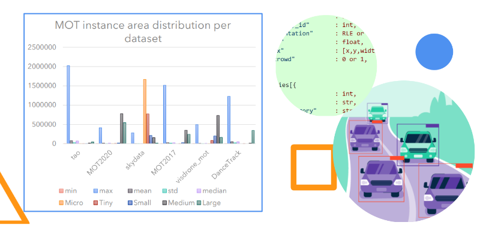

# Vision Datasets Statistics


<div style="margin:auto;">

</div>

In `computer vision`, we have a lot of datasets that are used for different tasks (i.e, classification, detection, segmentation, tracking...). These datasets in a form of images and/or videos are used to train and test models. 

Here we take a look at the statistics for datasets used for the 3 main tasks in computer vision (`Detection`, `Segmentation`, and `Tracking`). While attempting to do so we provide converters to standardized formats and PyTorch data loader implementations for specific datasets.

We are going to look at the statistics of each dataset and perform a comparison in the end. To do this we will need to load each dataset and extract it's statistics programmatically. We will also need to visualize the statistics in a way that is easy to understand. Last but not least the statistics will be compared.

---
## Task based datasets lookup table

<table style="list-style: none;">
    <thead>
        <tr>
            <th>Task</th>
            <th> Detection Based </th>
            <!-- <th>Semantic Segmentation</th> -->
            <th>Instance Segmentation</th>
            <!-- <th>Single Object Tracking</th> -->
            <th>Multi Object Tracking</th>
            <th>Video Instance Segmentation</th>
        </tr>
    </thead>
    <tbody>
        <tr>
            <th>Dataset</th>
            <td><!-- det -->
                <li>✓ COCO</li>
                <li>✓ SkyData </li>
                <li>✓ VisDrone</li>
                <li>✓ KAIST </li>
                <li>✓ VHR-10 </li>
                <li>✓ DOTA </li>
                <li>✓ VEDAI </li>
                <li>✓ KITTI </li>
            </td>
            <!-- <td>
                <li> COCO</li>
                <li> SkyData </li>
                <li> KITTI </li>
                <li> VHR-10 </li>
                <li> MOTS </li>
            </td> -->
            <td><!-- seg -->
                <li>✓ COCO</li>
                <li>✓ SkyData </li>
                <li>✓ VHR-10 </li>
            </td>
            <!-- <td>
                <li>SkyData</li>               
                <li> UAV123 </li>               
                <li> VOT2018 </li>              
            </td> -->
            <td><!-- mot -->
                <li>✓ SkyData</li>
                <li>✓ VisDrone-MOT </li>
                <li>✓ MOT-17 </li>
                <li>✓ MOT-20 </li>
                <li>✓ DanceTrack </li>
                <li>✓ TAO </li>
                <!-- <li> KAIST </li> -->
                <!-- <li> Lvis </li>
                 -->
            </td>
            <td><!-- vis -->
                <li>✓ SkyData</li>
                <li>✓ Youtube-VIS 2019 </li>
                <li>✓ Youtube-VIS 2021 </li>
            </td>
        </tr>
    </tbody>
</table>


---
## Getting Started

For more details on how to use the repo, please refer to the [docs](./resources/docs/Dataset%20Stats%20trimmed.pdf)

```bash
# Get REPO
#1. clone and setup up the repo
!git clone https://github.com/ozerlabs-proxy/vision-datasets-
stats.git
#2. cd into the repo
cd vision-datasets-stats
#3.
#we require conda to be installed
#alternatively you can any other env
conda env create -f environment.yaml
conda activate VisionStats
#4. follow along the notebooks
```

---
## Stats 

There is a number of stats about datasets that can be generated. These may vary depending on the task, for most we will derive the following:
<table>
    <thead>
        <tr>
            <th> - </th>
            <th>Detection</th>
            <th>Tracking</th>
        </tr>
    </thead>
    <tbody>
        <tr>
            <th>Stats</th>
            <td>
                <ol>
                    <li>✓ Number of images</li>
                    <li>✓ Number of objects</li>
                    <li>✓ Number of classes</li>
                    <li>✓ Number of instances per class</li>
                    <li>✓ Average number of instances per image</li>
                    <li>✓ Average number of instances per class</li>
                </ol>
            </td>
            <td>
                <ol>
                    <li>✓ Number of videos</li>
                    <li>✓ Number of tracks</li>
                    <li>✓ Number of categories</li>
                    <li>✓ average track length</li>
                    <li>✓ average number of tracks per video</li>
                    <li>✓ average number of tracks per category</li>
                    <li>✓ video lengths</li>
                    <li>✓ min-max resolutions</li>
                    <li>✓ areas stats ... </li>
                </ol>
            </td>
        </tr>
    </tbody>
</table>

---
# Contribution
We are open to contributions, if you have a dataset that you would like to add to the list, please do so by following the steps in the [contribution guide](./resources/docs/Dataset%20Stats%20trimmed.pdf).


